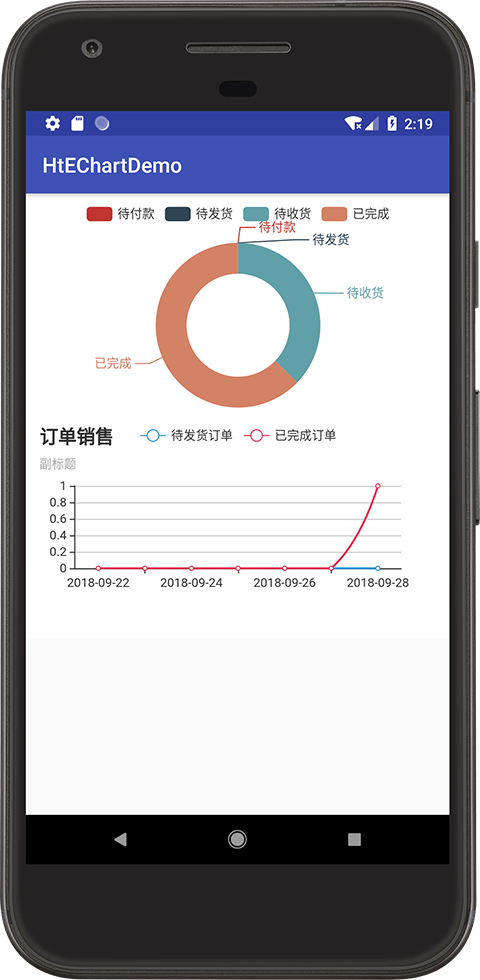

# HtEChart
## 概述
这是一个Android Library 实现对EChart的封装
关于[EChart](http://echarts.baidu.com/feature.html)

效果图如下：




## 使用教程
1.在module的build.gradle引用类库
```groovy
dependencies {
    implementation fileTree(include: ['*.jar'], dir: 'libs')
    implementation project(':htechart')
}
```
2.在xml布局文件里使用HtEChartView控件
```xml
<com.github.xiaohu409.htechart.widget.HtEChartView
    android:layout_width="match_parent"
    android:layout_height="wrap_content"
    android:id="@+id/ht_echart_id1"/>
```
3.在代码里实例化控件，并绑定数据
```java
//数据格式为json
//格式说明可以查看百度EChart文档
//http://echarts.baidu.com/tutorial.html
String data1 = "{\"title\":{\"show\":false,\"text\":\"订单状态百分比\",\"subtext\":\"\"},\"tooltip\":{\"trigger\":\"item\",\"formatter\":\"{a} <br/>{b} : {c} ({d}%)\"},\"series\":[{\"center\":[\"50%\",\"60%\"],\"radius\":[\"50%\",\"80%\"],\"type\":\"pie\",\"name\":\"订单笔数\",\"data\":[{\"name\":\"待付款\",\"value\":\"0\"},{\"name\":\"待发货\",\"value\":\"0\"},{\"name\":\"待收货\",\"value\":\"16\"},{\"name\":\"已完成\",\"value\":\"27\"}]}],\"legend\":{\"show\":false,\"data\":[\"待付款\",\"待发货\",\"待收货\",\"已完成\"]}}";
String data2 = "{\"color\":[\"#3398DB\",\"#e43c59\"],\"title\":{\"show\":false,\"text\":\"订单销售走势统计图\",\"subtext\":\"订单销售走势统计图\"},\"tooltip\":{\"trigger\":\"axis\",\"axisPointer\":{\"type\":\"shadow\"}},\"grid\":{\"zlevel\":0,\"z\":0,\"borderWidth\":0,\"containLable\":true},\"xAxis\":[{\"type\":\"category\",\"axisTick\":{\"show\":true,\"splitNumber\":0},\"data\":[\"2018-09-22\",\"2018-09-23\",\"2018-09-24\",\"2018-09-25\",\"2018-09-26\",\"2018-09-27\",\"2018-09-28\"]}],\"yAxis\":[{\"type\":\"value\",\"axisLabel\":{\"formatter\":\"{value}\"}}],\"series\":[{\"smooth\":true,\"type\":\"line\",\"name\":\"待发货订单\",\"data\":[\"0\",\"0\",\"0\",\"0\",\"0\",\"0\",\"0\"]},{\"smooth\":true,\"type\":\"line\",\"name\":\"已完成订单\",\"data\":[\"0\",\"0\",\"0\",\"0\",\"0\",\"0\",\"1\"]}],\"legend\":{\"show\":false,\"data\":[\"待发货订单\",\"已完成订单\"]}}";
//实例化EChart
HtEChartView eChart1 = findViewById(R.id.ht_echart_id1);
//绑定数据
eChart1.setData(data1);
HtEChartView eChart2 = findViewById(R.id.ht_echart_id2);
eChart2.setData(data2);
```